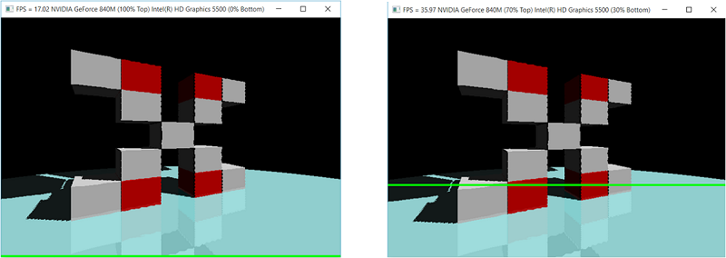

# DISCONTINUATION OF PROJECT #
This project will no longer be maintained by Intel.
Intel has ceased development and contributions including, but not limited to, maintenance, bug fixes, new releases, or updates, to this project.
Intel no longer accepts patches to this project.
# DirectX 12 Multi-Adapter Sample

This sample uses explicit, heterogeneous multi-adapter techniques in DirectX 12 to implement split-frame rendering of a ray-traced scene across two GPUs. For more details, please see https://software.intel.com/en-us/articles/multi-adapter-support-in-directx-12.

